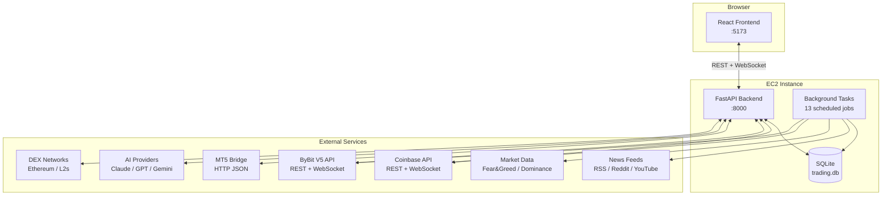
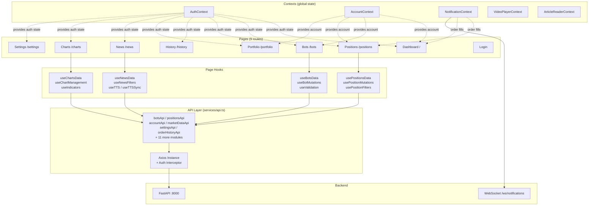
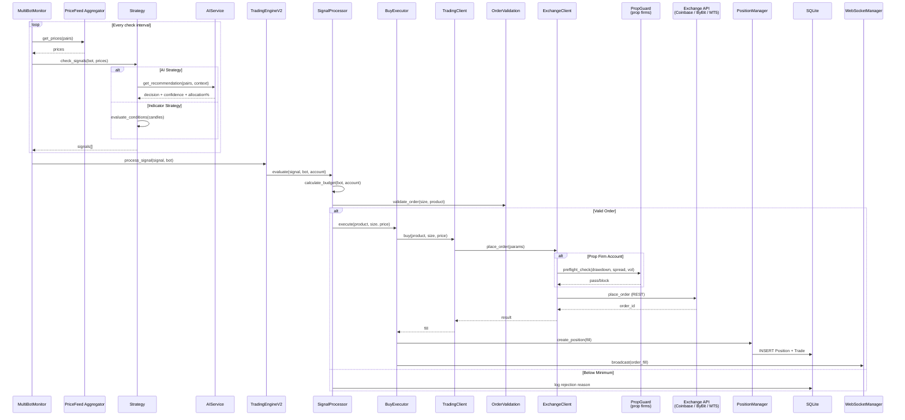
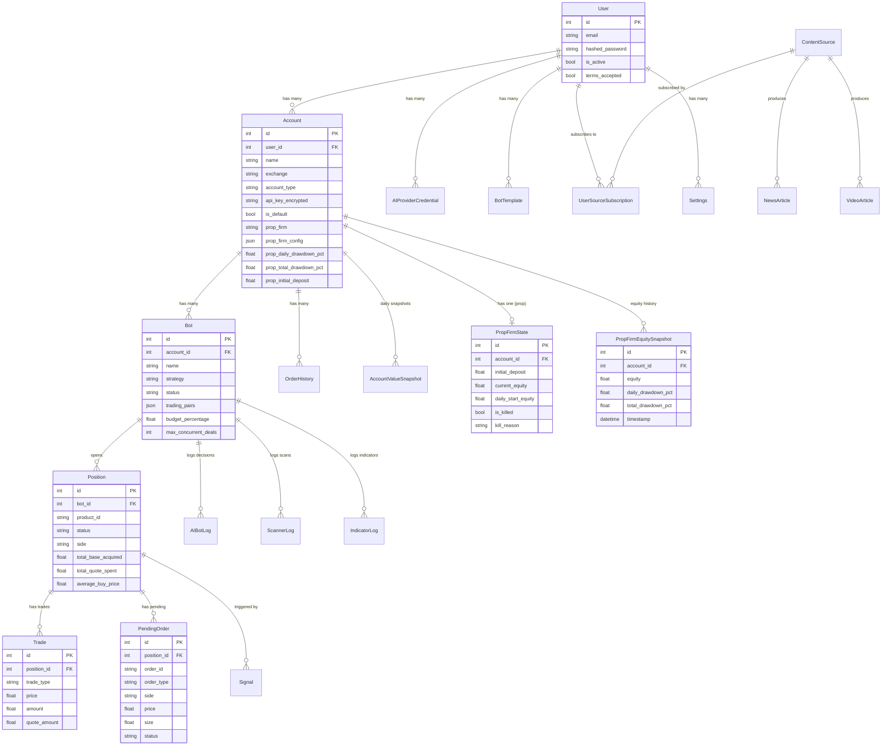

# ZenithGrid Architecture

> Machine-readable catalog: [`architecture.json`](architecture.json)

## Stack & Deployment

| Layer | Technology |
|-------|-----------|
| Backend | FastAPI + SQLAlchemy (async) + SQLite |
| Frontend | React 18 + TypeScript + Vite + TailwindCSS |
| State | React Context (app) + React Query (server) |
| Charts | TradingView Lightweight Charts |
| Auth | JWT (python-jose) + bcrypt |
| Encryption | Fernet (AES-128-CBC + HMAC-SHA256) |
| Deployment | AWS EC2 (Amazon Linux 2023) + systemd |
| Exchange | Coinbase (HMAC/CDP), ByBit V5, MT5 Bridge |
| AI | Anthropic Claude, OpenAI GPT, Google Gemini |

The backend runs as a systemd service (`trading-bot-backend`) on port 8000.
The frontend runs as a Vite dev server (`trading-bot-frontend`) on port 5173.
Both auto-start on boot.

---

## 1. System Overview

---

## 2. Backend Layers

```mermaid
graph TB
    subgraph "API Layer (20 routers)"
        R_AUTH[auth]
        R_BOTS[bots<br/><small>crud / control / ai_logs<br/>indicator_logs / scanner_logs / validation</small>]
        R_POS[positions<br/><small>queries / actions / limit_orders<br/>manual_ops / perps</small>]
        R_ACCT[accounts]
        R_MKT[market_data]
        R_NEWS[news<br/><small>sources / cache / models<br/>debt_ceiling</small>]
        R_TRADE[trading]
        R_OTHER[settings / templates<br/>order_history / blacklist<br/>seasonality / sources<br/>ai_credentials / ...]
    end

    subgraph "Service Layer"
        SVC_GRID[GridTradingService]
        SVC_BUDGET[BudgetCalculator]
        SVC_EXCH[ExchangeService]
        SVC_AI_OPT[AIGridOptimizer]
        SVC_SNAP[AccountSnapshotService]
        SVC_COIN[CoinReviewService]
    end

    subgraph "Trading Engine"
        MBM[MultiBotMonitor]
        TEV2[TradingEngineV2]
        subgraph "Engine Modules"
            SIG[SignalProcessor]
            BUY[BuyExecutor]
            SELL[SellExecutor]
            PERPS_EX[PerpsExecutor]
            PM[PositionManager]
            OL[OrderLogger]
            TS[TrailingStops]
        end
        TC[TradingClient]
        OV[OrderValidation]
        PREC[Precision]
    end

    subgraph "Strategy Layer"
        S_GRID[GridTradingStrategy]
        S_IND[IndicatorBasedStrategy]
        S_STAT[StatisticalArbitrage]
        S_SPAT[SpatialArbitrage]
        S_TRI[TriangularArbitrage]
    end

    subgraph "Exchange Clients"
        BASE[ExchangeClient ABC]
        CADAP[CoinbaseAdapter]
        BBADAP[ByBitAdapter]
        MT5C[MT5BridgeClient]
        PGUARD[PropGuardClient<br/><small>safety decorator</small>]
        PAPER[PaperTradingClient]
        DEXC[DexClient]
        FACTORY[Factory]
    end

    subgraph "Coinbase API Modules"
        CB_AUTH[auth.py]
        CB_BAL[account_balance_api.py]
        CB_MKT[market_data_api.py]
        CB_ORD[order_api.py]
        CB_PERP[perpetuals_api.py]
    end

    subgraph "ByBit Modules"
        BB_CLIENT[ByBitClient<br/><small>pybit + asyncio.to_thread</small>]
        BB_WS[ByBitWSManager<br/><small>equity / position / ticker</small>]
    end

    subgraph "Core"
        AI_SVC[AIService]
        COND[Conditions]
        INDCALC[IndicatorCalculator]
        IND_MOD[Indicators<br/><small>ai_spot_opinion / bull_flag<br/>risk_presets</small>]
        CACHE[Cache]
        ENC[Encryption]
        CFG[Config]
        DB[(SQLite)]
    end

    subgraph "Price Feeds"
        PF_AGG[Aggregator]
        PF_CB[CoinbaseFeed]
        PF_DEX[DexFeed]
    end

    R_BOTS --> SVC_GRID
    R_BOTS --> MBM
    R_POS --> TEV2
    R_TRADE --> TC
    R_ACCT --> SVC_EXCH

    MBM --> S_GRID & S_IND & S_STAT & S_SPAT & S_TRI
    S_GRID --> COND & INDCALC
    S_IND --> COND & INDCALC
    INDCALC --> IND_MOD
    TEV2 --> SIG --> BUY & SELL & PERPS_EX
    TEV2 --> PM & OL & TS
    BUY & SELL --> TC
    TC --> OV --> PREC
    TC --> FACTORY

    SVC_EXCH --> FACTORY
    FACTORY --> CADAP & BBADAP & MT5C & PAPER & DEXC
    PGUARD -.->|wraps| BBADAP & MT5C
    CADAP --> CB_AUTH & CB_BAL & CB_MKT & CB_ORD & CB_PERP
    BBADAP --> BB_CLIENT
    BB_WS -.->|real-time state| PGUARD
    BASE -.->|interface| CADAP & BBADAP & MT5C & PAPER & DEXC & PGUARD

    MBM --> PF_AGG
    PF_AGG --> PF_CB & PF_DEX

    S_GRID -.-> AI_SVC
    SVC_AI_OPT --> AI_SVC
    SVC_COIN --> AI_SVC
    AI_SVC --> ENC

    SVC_GRID --> DB
    SVC_SNAP --> DB
    TEV2 --> DB
```

---

## 3. Frontend Layers

---

## 4. Trading Flow

---

## 5. Data Model

---

## Authentication Flow

1. User submits email/password to `POST /api/auth/login`
2. Backend verifies bcrypt hash, issues JWT access + refresh tokens
3. Frontend stores tokens in `localStorage` via `AuthContext`
4. Every API request includes `Authorization: Bearer {token}` via Axios interceptor
5. Backend `get_current_user` dependency validates JWT on protected routes
6. On 401 response, frontend clears session and redirects to login
7. On first login, `RiskDisclaimer` modal requires terms acceptance

## Multi-Tenancy Model

- Single-user deployment (owner-operator) but architected for multi-user
- `User` -> `Account` -> `Bot` -> `Position` hierarchy enforces data isolation
- Each user has their own encrypted exchange credentials, AI provider keys, and settings
- All API routes require JWT authentication and scope queries to the authenticated user

## Background Task Scheduling

All background tasks are launched in `main.py` during the FastAPI `startup` event:

| Task | Interval | Method |
|------|----------|--------|
| MultiBotMonitor | Per-strategy | `asyncio` event loop |
| LimitOrderMonitor | 10s | `asyncio.create_task` loop |
| OrderReconciliationMonitor | 60s | `asyncio.create_task` loop |
| MissingOrderDetector | 5min | `asyncio.create_task` loop |
| TradingPairMonitor | Daily | Service `.start()` method |
| ContentRefreshService | 30min/60min | Service `.start()` method |
| DebtCeilingMonitor | Weekly | Service `.start()` method |
| AutoBuyMonitor | Per-account | Service `.start()` method |
| PerpsMonitor | 60s | Service `.start()` method |
| PropGuardMonitor | 30s | `asyncio.create_task` loop |
| DecisionLogCleanup | Daily | `asyncio.create_task` loop |
| FailedConditionCleanup | 6h | `asyncio.create_task` loop |
| FailedOrderCleanup | 6h | `asyncio.create_task` loop |
| AccountSnapshotCapture | Daily | `asyncio.create_task` loop |

All tasks are cancelled gracefully during `shutdown` event. The `ShutdownManager` ensures no orders are mid-execution before allowing shutdown.
