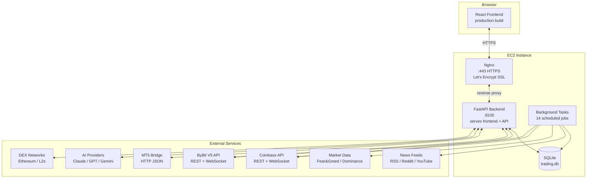
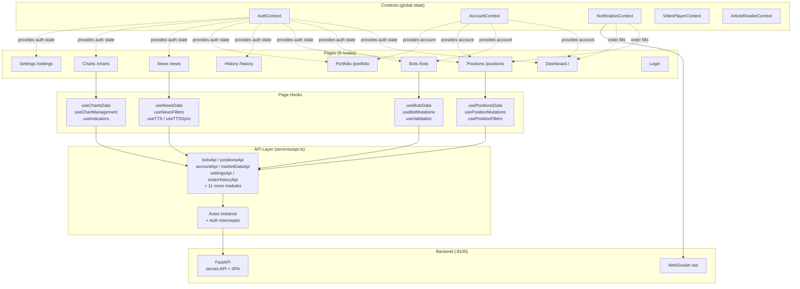
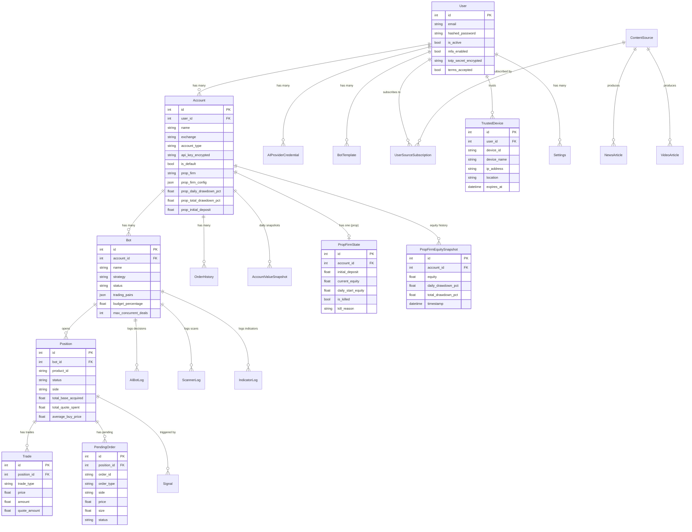

# ZenithGrid Architecture

> Machine-readable catalog: [`architecture.json`](architecture.json)

## Stack & Deployment

| Layer | Technology |
|-------|-----------|
| Backend | FastAPI + SQLAlchemy (async) + SQLite |
| Frontend | React 18 + TypeScript + Vite + TailwindCSS |
| State | React Context (app) + React Query (server) |
| Charts | TradingView Lightweight Charts |
| Auth | JWT (python-jose) + bcrypt + TOTP MFA (pyotp) |
| Encryption | Fernet (AES-128-CBC + HMAC-SHA256) |
| Deployment | AWS EC2 (Amazon Linux 2023) + Nginx + Let's Encrypt SSL + systemd |
| Exchange | Coinbase (HMAC/CDP), ByBit V5, MT5 Bridge |
| AI | Anthropic Claude, OpenAI GPT, Google Gemini |

The backend runs as a systemd service (`trading-bot-backend`) on port 8100.
Nginx reverse-proxies HTTPS (port 443) to the backend, with Let's Encrypt SSL via Certbot.
Public URL: `https://tradebot.romerotechsolutions.com`
The frontend is a production build (`vite build`) served by the FastAPI backend — no separate frontend service needed.
The service auto-starts on boot.

---

## 1. System Overview

---

## 2. Backend Layers

---

## 3. Frontend Layers

---

## 4. Trading Flow

---

## 5. Data Model

---

## Authentication Flow

1. User submits email/password to `POST /api/auth/login`
2. Backend verifies bcrypt hash
3. **If MFA enabled**: check for trusted device token
   - If valid trusted device: skip MFA, issue tokens directly
   - If no trusted device: return `mfa_required=true` with short-lived `mfa_token` (5-min JWT)
   - User enters 6-digit TOTP code from authenticator app
   - Optional: "Remember this device for 30 days" checkbox stores a `device_trust_token`
   - Trusted device record saved in DB with device name, IP, and geolocation (city, state, country)
4. **If MFA not enabled**: issue JWT access + refresh tokens directly
5. Frontend stores tokens in `localStorage` via `AuthContext`
6. Every API request includes `Authorization: Bearer {token}` via Axios interceptor
7. Backend `get_current_user` dependency validates JWT on protected routes
8. On 401 response, frontend attempts token refresh before logout; queues concurrent requests during refresh
9. On first login, `RiskDisclaimer` modal requires terms acceptance

### MFA Management

- Users enable/disable TOTP MFA from Settings > Account Security
- Setup: QR code (backend-generated PNG) + manual key entry + verification code
- Disable: requires current password + TOTP code
- Trusted devices: viewable and revocable from Settings (device name, location, date added)
- TOTP secrets encrypted at rest with Fernet (AES-128-CBC + HMAC-SHA256)
- Public signup disabled; new users created by admin only

## Multi-Tenancy Model

- Single-user deployment (owner-operator) but architected for multi-user
- `User` -> `Account` -> `Bot` -> `Position` hierarchy enforces data isolation
- Each user has their own encrypted exchange credentials, AI provider keys, and settings
- All API routes require JWT authentication and scope queries to the authenticated user

## Background Task Scheduling

All background tasks are launched in `main.py` during the FastAPI `startup` event:

| Task | Interval | Method |
|------|----------|--------|
| MultiBotMonitor | Per-strategy | `asyncio` event loop |
| LimitOrderMonitor | 10s | `asyncio.create_task` loop |
| OrderReconciliationMonitor | 60s | `asyncio.create_task` loop |
| MissingOrderDetector | 5min | `asyncio.create_task` loop |
| TradingPairMonitor | Daily | Service `.start()` method |
| ContentRefreshService | 30min/60min | Service `.start()` method |
| DebtCeilingMonitor | Weekly | Service `.start()` method |
| AutoBuyMonitor | Per-account | Service `.start()` method |
| PerpsMonitor | 60s | Service `.start()` method |
| PropGuardMonitor | 30s | `asyncio.create_task` loop |
| DecisionLogCleanup | Daily | `asyncio.create_task` loop |
| FailedConditionCleanup | 6h | `asyncio.create_task` loop |
| FailedOrderCleanup | 6h | `asyncio.create_task` loop |
| AccountSnapshotCapture | Daily | `asyncio.create_task` loop |

All tasks are cancelled gracefully during `shutdown` event. The `ShutdownManager` ensures no orders are mid-execution before allowing shutdown.
